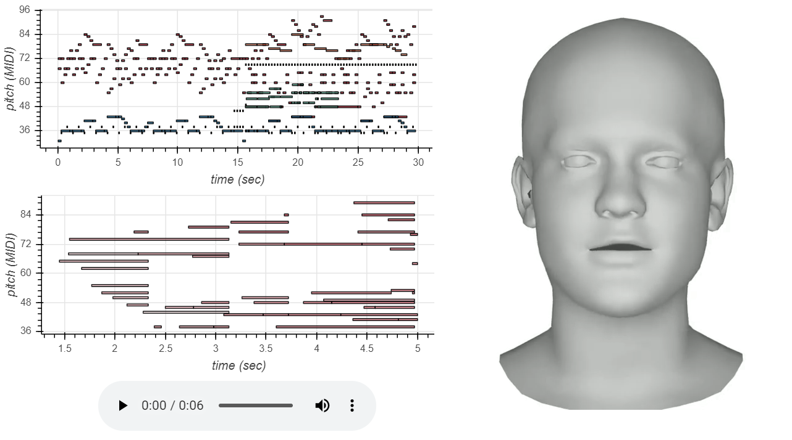

# Final Project

Joseph Chang, jdchang@ucsd.edu

## Abstract

The goal of this project is to produce a music video containing music, lyrics sung by a human voice, and a singing face generated in Python using Machine learning. This hands-off approach will allow artists to experiment with new music, find inspiration for new songs, and generate a completely new music video from scratch. Written lyrics are input into DeepVoice3 which translates it into speech using a model trained on a woman's voice. In this project, hopeful quotes are used as lyrics. Performance RNN separately produces a musical piece composed of multiple music phrases generated using a model trained on a bass guitar. Gansynth interpolates a MIDI sound file of Frank Mill's Musicbox Dancer to produce another musical score. Voice Operated Character Animation (VOCA) uses a Deep Neural Network to produce a 4D human face speaking the generated lyrics. Finally, the speech, generated music, interpolated music, and human face video are combined on the Davinci Resolve video editor. This project succeeds in producing comprehendible human speech, completely new music, and a singing face. However, it is not near the quality one would expect from an actual artist. A future direction would be to include training a RNN model for singing rather than just speaking. The result of this work is presented as a YouTube video and each of the four individual components available in this repository.

## Project Report

Upload your project report (4 pages) as a pdf with your repository, following this template: [google docs](https://docs.google.com/document/d/133H59WZBmH6MlAgFSskFLMQITeIC5d9b2iuzsOfa4E8/edit?usp=sharing).

## Model/Data

DeepVoice3 is trained on the model 20180505_deepvoice3_ljspeech.json which is found online. The code automatically downloads it.

DeepVoice3 converts the following hopeful quotes text to speech
- "Good, better, best. Never let it rest. 'Til your good is better and your better is best."
- "The most beautiful things in the world cannot be seen or even touched. They must be felt with the heart."
- "The best preparation for tomorrow is doing your best."
- "Every next level of your life will demand a different you."
- "If your goals don't scare you. They aren't big enough."
- "Don't listen to what they say."
- "Be fearless in the pursuit of what sets your soul on fire."
- "The greatest glory in living lies not in never falling, but in rising every time we fall."

SGM-v2.01-Sal-Guit-Bass-V1.3.sf2
- https://sites.google.com/site/soundfonts4u/
- Performance RNN is run on this audio sample from Soundfonts4u which combines guitar and bass.
- Place it in the /tmp/ directory.

Frank_Mills_-_ Musicbox_Dancer.mid
- https://www.midiworld.com/search/?q=dance
- Gansynth interpolates this music piece from Midiworld.
- Place it in the /gansynth/midi/ directory.

DeepSpeech model v0.1.0
- https://github.com/mozilla/DeepSpeech/releases/tag/v0.1.0
- Found under assets > deepspeech-0.1.0-models.tar.gz
- VOCA translates speech to text with this pretrained model.
- Place it in the /ds_graph/ directory.
- Unpack with tar -xvf deepspeech-0.1.0-models.tar.gz


VOCA Models
- https://voca.is.tue.mpg.de/en
- VOCA models are used to match speech to facial expressions.
- Register for an account, Confirm e-mail, Go to Downloads, Download trained VOCA model.
- Move gstep_52280.model.meta // .data-00000-of-00001 (checkpoint) // .index to /model/ directory.

## Code

DeepVoice3 
- https://colab.research.google.com/drive/1JpWuvyPCZqGdsXuclHqKidvf2yx_NFtc
- Training and generation code
- Converts the following hopeful quotes text to a woman's speech

Performance RNN
- https://colab.research.google.com/drive/1W6yGQP3bJ-IfvSpLgr9ELJ68jr6SBgES
- Takes SGM-v2.01-Sal-Guit-Bass-V1.3.sf2 music as input to build the RNN
- Generates similar sounding samples of music each 5 seconds long (length can be adjusted)

Gansynth
- https://colab.research.google.com/drive/1W6yGQP3bJ-IfvSpLgr9ELJ68jr6SBgES
- Takes Frank_Mills_-_ Musicbox_Dancer.mid as input and interpolates the music

VOCA
- https://github.com/TimoBolkart/voca
- Clone the repository (full instructions to run under Technical Notes)
- Takes speech_combined.wav as input and outputs video animation of a face speaking the words

## Results



The resulting speech and music can be found in this repository. The text-to-speech generated by DeepVoice3 are the speech.wav files. The music generated by PerformanceRNN based on the guitar-bass audio are the music.mp3 files. The Musicbox Dancer music interpolated by Gansynth is the musicbox-gansynth.wav file. The singing face is the face_video.mp4 file. The 8 speech outputs, 8 music outputs, 1 interpolated song, and 1 singing face are combined in the DaVinci Resolve video editor and uploaded to YouTube for viewing. The resulting speech and music are much below the quality expected from a composer or songwriter, but as something generated by a machine, it is quite impressive. 

**Video combining all results**
https://www.youtube.com/watch?v=afJv4J1Y424

## Technical Notes

DeepVoice3, Performance RNN, and Gansynth require Google Colab which is an open source coding notebook. It only runs on Colab even though it is in Python Notebook format.

VOCA encounters many bugs which are not solved in the original repository. These are the full instructions to get it to run.

Download [VMWare](https://my.vmware.com/en/web/vmware/free#desktop_end_user_computing/vmware_workstation_player/15_0), Download [Ubuntu iso](https://ubuntu.com/download/desktop), Create a New Virtual Machine, Open Terminal
```
sudo apt update
sudo apt -y upgrade
sudo apt install git
git clone https://github.com/TimoBolkart/voca.git

```
Ensure Python 3.6 or under 
```
python3 -V
```
Create virtual environment (voca), activate it, 
```
sudo apt install -y python3-pip
sudo apt install build-essential libssl-dev libffi-dev python3-dev
sudo apt install -y python3-venv
python3.6 -m venv voca
source /home/josephdanielchang/.virtualenvs/voca/bin/activate
```
Install required packages
```
pip install -r requirements.txt
```
Error will show up for downloading tensorflow-gpu 1.14.0. Simply enter:
```
pip install --no-cache-dir tensorflow-gpu
```
and manually pip install the remaining requirements scikit-learn, image, ipython, matplotlib, trimesh, pyrender. Now, we need to install mesh processing libraries from MPI-IS/mesh within the virtual environment.
```
sudo apt-get install libboost-dev
make all
make tests
make documentation
```
Add speech_combined.wav to /audio/ directory
```
pip install resampy
pip install python_speech_features
```
Download the DeepSpeech and VOCA models to the correct directories as instructed in the Model/Data section.

Go to ```/home/username/.virtualenvs/voca/lib/python3.6/site-packages/pyrender```
```
cd pyrender
nano constants.py
```
Change 
OPEN_GL_MAJOR = 4
OPEN_GL_MINOR = 1
to
OPEN_GL_MAJOR = 3
OPEN_GL_MINOR = 3

Finally, execute the following in the main /voca/ directory to produce a front facing .mp4 of the input speech.
```
python run_voca.py --tf_model_fname './model/gstep_52280.model' --ds_fname './ds_graph/models/output_graph.pb' --audio_fname './audio/speech_combined.wav' --template_fname './template/FLAME_sample.ply' --condition_idx 3 --out_path './animation_output'
```

This work only generates a basic front facing head, but more complex animations can also be rendered.

ADD BLINKS
```
python edit_sequences.py --source_path './animation_output/meshes' --out_path './FLAME_eye_blink' --flame_model_path  './flame/generic_model.pkl' --mode blink --num_blinks 2 --blink_duration 15
```
EDIT IDENTITY DEPENDENT SHAPE
```
python edit_sequences.py --source_path './animation_output/meshes' --out_path './FLAME_variation_shape' --flame_model_path  './flame/generic_model.pkl' --mode shape --index 0 --max_variation 3
```
EDIT HEAD POSE
```
python edit_sequences.py --source_path './animation_output/meshes' --out_path './FLAME_variation_pose' --flame_model_path  './flame/generic_model.pkl' --mode pose --index 3 --max_variation 0.52
```
RENDER SEQUENCE
```
python visualize_sequence.py --sequence_path './FLAME_eye_blink/meshes' --audio_fname './audio/test_sentence.wav' --out_path './FLAME_eye_blink'
python visualize_sequence.py --sequence_path './FLAME_variation_shape/meshes' --audio_fname './audio/test_sentence.wav' --out_path './FLAME_variation_shape'
python visualize_sequence.py --sequence_path './FLAME_variation_pose/meshes' --audio_fname './audio/test_sentence.wav' --out_path './FLAME_variation_pose'
```

## Reference

- [Online-Convert](https://audio.online-convert.com/convert-to-mp3): MIDI to MP3 Converter
- [Audio-Joiner](https://audio-joiner.com/): MP3 Audio Joiner
- [Bear Audio](https://www.bearaudiotool.com/mp3-to-midi): MP3 to MIDI Converter
- [Trim Midi File](http://midi.mathewvp.com/midiTrim.php): Trim MIDI File
- [VOCA](https://github.com/TimoBolkart/voca): Voice Operated 3D Character Animation
- [Digital Ocean](https://www.digitalocean.com/community/tutorials/how-to-install-python-3-and-set-up-a-programming-environment-on-ubuntu-18-04-quickstart
): How to set up a Python Virtual Environment on Ubuntu 
- [MPI-IS](https://github.com/MPI-IS/mesh): Mesh Processing Libraries
